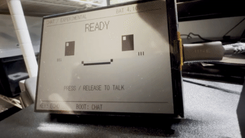

# RLCD 4.2 — sanoTTS / Offline Japanese Voice Lab

[English](README.en.md) · [音声認識・対話実験](experiments/offline-voice/README.md) · [学習元](experiments/offline-voice/docs/TRAINING.md) · [ライセンス](experiments/offline-voice/licenses/README.md)

## オフライン音声対話デモ

[](https://github.com/ochisamu/sanoTTS-jp-RLCD4.2/blob/main/media/offline-voice-demo.mp4)

クリックすると音付き動画を開けます。プレビューは無音・低フレームレートです。
動画は利用者提供の実機記録で、認識・推論時間を短縮していません。字幕見出しは
撮影時の版で、現行ファームでは `HEARD` / `REPLY` です。

**Powered by Moonshine AI**

今回追加した [experiments/offline-voice](experiments/offline-voice/README.md) は、
マイク→日本語音声認識→かな→端末内知識／小型生成LM→sanoTTS→スピーカーを
ESP32-S3だけで実行する実験版です。KEYはおうむ返し、BOOTは回答と読み上げ。
大きな顔・英語ステータス・一時的な日本語字幕を表示します。
Wi-Fi・クラウド・PC推論は使いません。**一般会話の品質は未達で、誤答します。**

このリポジトリには2種類の別ファームがあります。混ぜて書き込まないでください。

| フォルダ | 内容 |
| --- | --- |
| `firmware/`, `tools/demo.py` | 既存のTTS専用版。USBから文章を入力、漢字辞書対応 |
| `experiments/offline-voice/` | 新しいSTT＋SLM＋TTS実験。かな認識・既知回答の漢字字幕 |

[Release](https://github.com/ochisamu/sanoTTS-jp-RLCD4.2/releases) の音声対話ファームは
**モデル非同梱の開発者向けプレビュー**です。これだけでは新品の端末で認識・対話はできません。
STT/SLM/TTSモデルを別途準備してください。既存TTS版とはFlash配置が異なります。
[書き込み条件](experiments/offline-voice/docs/FIRMWARE_RELEASE.md)を必ず確認してください。
学習元・量子化モデル・録音・個体バックアップはGitにもReleaseにも収録しません。
対話重みの再配布判断は保留しています。

音声合成: sanoTTS-jp / つくよみちゃん（© Rei Yumesaki、CV.夢前黎）。
必須帰属文と[音声利用条件](experiments/offline-voice/licenses/VOICE_TERMS.md)は実験版READMEに記載しています。
動画・音声は自由な再利用素材としての提供ではありません。

## 既存のTTS専用版

Waveshare `ESP32-S3-RLCD-4.2` 専用の、オフライン日本語音声合成
[`sanoTTS-jp`](https://github.com/ayutaz/sanoTTS-jp) ファームウェアと実機デモツールです。
既存プロジェクトとは独立したリポジトリで、他のファームウェアや設定には依存しません。

初回検証は **18650電池とRTC電池を接続せず、データ通信対応USB-Cだけ** で行います。
USBの抜き差しや電池の着脱では、薄いRLCDパネルを持ったり支点にしたりしないでください。
基板側を平らな場所で支えます。これは
[Waveshare公式の取り扱い注意](https://docs.waveshare.com/ESP32-S3-RLCD-4.2)です。

起動時は無音です。まず工場状態を全Flashから二重退避し、ボードプローブ、無音合成、
USB給電での明示的な音声デモを順に完了してから、最後に18650／KEY単独デモへ進めます。

2026-09-02に実機1台で、ST7305表示、ES8311／付属スピーカー再生、18650電圧表示、
端末内の漢字かな変換、sanoTTS合成、USBからの連続文章入力を確認しました。個体固有のMAC、
factory image、シリアルログ、Wi-Fi情報はこのリポジトリとGit履歴に含めません。

## モデル、辞書、ファームウェアbinは含みません

このGitリポジトリに、モデル重み、漢字辞書、生成音声、factory backup、結合済みファームは
収録しません。利用者がモデルライセンスを読んで明示的に同意した後、`tools/demo.py fetch`が
上流のsanoTTS-jp GitHub Releaseから取得し、サイズとSHA-256を照合します。

| 取得物 | 外部リリース | size | SHA-256 |
|---|---|---:|---|
| `saanotts-jp-v4-int8.bin` | sanoTTS-jp `v1.0.0` | 654,032 | `a1eb6b0812e2ad2a228836088a3e34160cb66731492fb957a5891605db2fa1b6` |
| `k1-dict-438750.bin` | sanoTTS-jp `v1.0.0` | 13,702,320 | `f162c922074d76817298b34d8a8fd35f7d195f38540303485a76c956b5d84877` |

取得物はGit除外された`assets/`へ置かれます。ビルド成果物も`dist/`と`firmware/build*/`に
隔離され、Gitには入りません。PCはUTF-8文章を送るだけで、かな中間表現への変換とPCM生成は
ESP32-S3上で実行します。

## 対象ハードウェア

- Waveshare ESP32-S3-RLCD-4.2、SKU 33298（18650同梱）
- Waveshare ESP32-S3-RLCD-4.2-EN、SKU 33507（18650非同梱）
- ESP32-S3-WROOM-1-N16R8: 16 MB QIO Flash、8 MB Octal PSRAM
- ST7305 4.2インチ反射型LCD、300x400（横表示400x300）、1 bit、バックライトなし
- ES8311 DAC、NS4150Bアンプ、着脱式8 Ω / 2 Wスピーカー
- ES7210 ADCと基板上のデュアルマイク（今回の再生デモでは未使用）

2つのSKUは公式資料上、18650の同梱有無だけが異なります。別の基板リビジョン名は
公開されていません。調査基準は公式リポジトリ commit
`eb1f63427d735a22b9c30e22fa63ebddae1834d3` と
[公式回路図](https://files.waveshare.com/wiki/ESP32-S3-RLCD-4.2/ESP32-S3-RLCD-4.2-schematic.pdf)です。

### タッチパネルはありません

製品はタッチ対応をうたっておらず、現行回路図ではLCD FPCの `TP_RESET`、`TP_INT`、
`TP_SDA`、`TP_SCL` がすべてNCです。タッチコントローラーも実装されていません。
公式のインターフェース表には古いTP信号名が残っていますが、回路図と公式サンプルには
タッチ処理がありません。このリポジトリもタッチを初期化しません。側面のKEY
（GPIO18）はボードプローブで押下確認に使います。TTSプロファイルでは、起動後の新しい
押下とデバウンス済み解放により固定デモ文を1回だけ実行します。任意の文章入力は
USBシリアルから行います。

現在の対応版は sanoTTS-jp **v1.0.0**（v4 int8モデル）です。更新時は
`git pull --ff-only` → `git submodule update --init --recursive` →
`python3 tools/demo.py fetch --kanji --accept-model-license` → 再ビルドの順で進めてください。
v3モデルは新ファームに使用できません。ファームとv4モデルをセットで書き込みます。
これまでの実機記録は旧版の結果です。v1.0.0対応版の実機での音質・電池動作は未確認です。
変更点・更新手順・検証結果は [v1.0対応メモ](docs/v1-upgrade.md) にまとめています。

## 重要：sanoTTSの汎用binは書き込まない

上流の汎用ESP32-S3ファームは仮I2S配線 GPIO5/6/7 を使います。このボードでは
GPIO5がLCD DC、GPIO6がLCD TEで、実際の音声I2S配線とも一致しません。
上流配布の `esp32s3-firmware-*.bin` をこのボードへ直接書き込まないでください。

この専用ファームの主要配線は次のとおりです。

| 機能 | GPIO / 設定 |
|---|---|
| RLCD ST7305 | DC=5、TE=6、SCLK=11、MOSI=12、CS=40、RESET=41、SPI mode 0 / 10 MHz |
| I2C共通 | SDA=13、SCL=14 |
| ES8311再生 | I2C `0x18`、MCLK=16、BCLK=9、LRCK=45、DOUT=8 |
| ES7210録音 | I2C `0x40`、DIN=10（MCLK/BCLK/LRCKは共通） |
| スピーカーアンプ | PA_EN=46、通常LOW、再生時だけHIGH |
| microSD | SDMMC 1-bit、CLK=38、CMD=21、D0=39 |
| ボタン | BOOT=0、KEY=18（ともにactive-low）。PWRはGPIOではない |
| 電池電圧 | BAT_ADC=GPIO4 / ADC1_CH3、12 dB、12 bit、校正後に分圧比x3で換算（観測専用） |
| USB / UART0 | USB D-=19、D+=20、UART0 TX=43、RX=44 |

完全な構成は [docs/architecture.md](docs/architecture.md)、安全条件と復旧方法は
[docs/safety.md](docs/safety.md) にあります。

## 必要なもの

- Git
- Python 3.10以上
- ESP-IDF 5.5.4（Waveshare公式要件は5.5.0以上）
- ESP-IDFに同梱される `esptool`
- 自動デモ用PySerial: `python3 -m pip install pyserial`
- データ通信対応USB-Cケーブル

以下のコマンドはLinux／WSL表記で `python3` を使います。WindowsのESP-IDF PowerShellでは
`python3` だけを `python` に読み替えてください。すべて1行コマンドなので、Bashと
PowerShellで改行記号を読み替える必要はありません。WSLの場合はUSBをWSLへ接続し、
`/dev/ttyACM*` が見える状態にします。

## 初回手順

### 0. ソースとモデルの準備

モデル重みと生成音声はMITライセンスではありません。条件を読んでから取得します。

```bash
git clone --recurse-submodules https://github.com/ochisamu/sanoTTS-jp-RLCD4.2.git
cd sanoTTS-jp-RLCD4.2
git submodule update --init --recursive
python3 tools/demo.py check
python3 tools/demo.py fetch --kanji --accept-model-license
python3 -m pip install pyserial
```

この時点ではスピーカー、18650、RTC電池を接続しません。

### 1. 接続診断とraw factory backup

基板部分を平らな場所に置き、USB-Cだけを接続してからポートを列挙します。表示された
`PORT` はWindowsなら `COM5`、Linux／WSLなら `/dev/ttyACM0` などです。
`--confirm-board` は誤接続した別のESP32-S3へ書き込まないための明示確認です。

```bash
python3 tools/demo.py ports
python3 tools/demo.py doctor --port PORT --confirm-board ESP32-S3-RLCD-4.2
python3 tools/demo.py backup --port PORT --confirm-board ESP32-S3-RLCD-4.2
```

`backup` は0x000000から16 MiB全体を2回読み、SHA-256が完全一致した時だけ、Linuxでは
`~/.local/share/rlcd42-sanotts-demo/backups/`、Windowsでは
`%LOCALAPPDATA%\RLCD42SanoTTSDemo\backups\` にrawイメージとJSONを採用します。
バックアップにはWi-Fi情報や端末固有設定が含まれ得るため、Gitやクラウドへ置かず、
私有の別ストレージにもコピーします。
同じMACで最初に受理した2回一致イメージだけを自動復旧用`recovery-baseline`とし、
後から取ったものは`snapshot`に分類します。`flash`が新しいcustom snapshotを工場状態と
取り違えることはありません。

### 2. ボードプローブ

最初の書き込みはモデルも音声再生も使わない `probe` です。PA_ENをLOWのまま、Flash／
PSRAM、LCD、I2Cデバイス、KEY、BAT_ADCの観測経路を確認します。

```bash
python3 tools/demo.py flash --port PORT --profile probe --confirm-board ESP32-S3-RLCD-4.2
python3 tools/demo.py monitor --port PORT --profile probe
```

LCDに白黒テストパターンが正しい向きで表示され、I2CでES8311 `0x18`、ES7210 `0x40`、
PCF85063 `0x51`、SHTC3 `0x70` が見え、タッチデバイスがなくても正常です。
USBだけのこの段階で得たBAT_ADC値から、18650の有無や給電源を推測しません。

### 3. 無音TTS

次にsanoTTSの推論だけを実行し、スピーカー経路はコンパイル時に無効化します。

```bash
python3 tools/demo.py flash --port PORT --profile kana --silent --confirm-board ESP32-S3-RLCD-4.2
python3 tools/demo.py demo --port PORT --profile kana --silent --confirm-board ESP32-S3-RLCD-4.2
```

v4モデルでは旧v3の27136 samples／FNV値は基準に使えません。
本デモは音素durationを1.15倍します。実機検証ではsamples、FNV、absmax、sumsq、
クリップ数、再起動の有無をまとめて記録してください。

### 4. 音声デモ

電源を切り、付属スピーカーをコネクターへ奥まで差し込み、再度USB-Cだけで起動します。
付属スピーカーでは公式factoryの既定値と同じ音量100で再生します。旧版実機での基準TTSのPCMピークは
約-10.5 dBFS、クリップ0で、公式factoryの音楽経路は音量90です。
聞き取りやすさのため、音素durationを1.15倍して声の高さを維持したまま少し遅くします。
PCMは実機で歪みが出たため増幅せず1.0倍とし、飽和制限とクリップ数計測を残します。

```bash
python3 tools/demo.py flash --port PORT --profile kana --confirm-board ESP32-S3-RLCD-4.2 --yes-speaker-connected
python3 tools/demo.py demo --port PORT --profile kana --confirm-board ESP32-S3-RLCD-4.2 --yes-speaker-connected
```

ファームは最大262,144 sample（約11.9秒）をPSRAMへ先行生成し、短い発話を途切れなく
再生します。I2Sの無音pre-roll後にPA_ENを有効にし、音量を徐々に上げ、末尾の無音を
送ってからPA_ENをLOWへ戻します。
起動時の自動発話、Wi-Fi接続、Bluetooth動作はありません。

任意のかな中間表現を送る場合：

```bash
python3 tools/demo.py demo --port PORT --profile kana --confirm-board ESP32-S3-RLCD-4.2 --yes-speaker-connected --text "こんにちわ"
python3 tools/demo.py monitor --port PORT --profile kana
```

## 18650・KEY単独デモ（USB音声合格後）

この試験は上のUSB給電による低音量音声デモまで合格した後だけ行います。ファームの書き込み、
ログ採取、任意文の送信には引き続きUSBが必要です。以下は書き込み済みのkana audio
プロファイルを18650で動かし、側面KEYだけで固定文を発話させる試験です。

1. 電源を切ってUSB-Cを抜き、基板側を平らな非導電面で支えます。極性を確認して標準の
   充電式18650を装着し、逆接警告の `WRN` LEDが点灯した場合や発熱、膨張、異臭がある場合は
   直ちに使用を中止します。
2. 公式FAQの手順どおり、装着後は最初にUSB-Cを接続して電池保護回路をactivateします。
   画面の `TTS READY` と3.00～4.20 Vの `BAT x.xxV` を確認してからUSB-Cを抜きます。
   `BAT ADC ERR`、`BAT --`、`BAT CHECK x.xxV` の場合は先へ進まず、電源を切って配線、電池、
   極性を再確認します。電源が切れていればPWRを短押しして起動します。PWRはMCUのGPIOでは
   なく、長押しが電源OFFです。
3. 起動時は発話しません。`TTS READY` の後にKEYを新しく押して解放すると、本ファームの
   固定低音量で「今日は良い天気ですね。」を1回だけ発話します。起動中から押し続けたKEYは、
   一度解放して改めて押すまで無視します。任意文をKEYから入力することはできません。

画面の `BAT x.xxV` はGPIO4の分圧点を校正してx3した観測値です。`BAT ADC ERR` は読取失敗、
`BAT CHECK x.xxV` は低い値も含む実装上の期待範囲外、`BAT --` は値を渡せない内部状態を
表します。Gate Eではこれら3表示のどれかが出たら先へ進みません。しかし **BAT_ADCだけでは、
セルの装着有無、充電中かどうか、USBと18650のどちらが
給電源かを判定できません**。ログの0～100%も公式サンプルと同じ3.00～4.12 Vの線形換算による
目安で、充電状態、安全な残量、software cutoffを意味しません。これらの値でPA_ENを許可／禁止
することもありません。

公式工場プログラムの稼働時間をこのsanoTTSファームへ当てはめず、電池持続時間は実測するまで
主張しません。USB接続中のBAT_ADC表示は実機確認済みですが、電池単独の持続時間と本ファームの
KEY固定文再生は未検証です。記録手順は[docs/bringup.md](docs/bringup.md)のGate Eにあります。

## 漢字プロファイル（実験的）

13.7 MBの辞書をFlashからmmapするため、OTAやファイルシステムを置かない専用
パーティション構成です。kanaの無音・音声テストを完了してから試します。

```bash
python3 tools/demo.py fetch --kanji --accept-model-license
python3 tools/demo.py flash --port PORT --profile kanji --silent --confirm-board ESP32-S3-RLCD-4.2
python3 tools/demo.py demo --port PORT --profile kanji --silent --confirm-board ESP32-S3-RLCD-4.2
python3 tools/demo.py flash --port PORT --profile kanji --confirm-board ESP32-S3-RLCD-4.2 --yes-speaker-connected
python3 tools/demo.py demo --port PORT --profile kanji --confirm-board ESP32-S3-RLCD-4.2 --yes-speaker-connected --message "おはようございます。"
```

`--message` は先頭の `!` を自動付与し、普通の漢字かな交じり文を端末内辞書へ渡します。
辞書にない語や長すぎる文は端末がエラーとして拒否するため、短く言い換えて再送します。

### Windowsから普段使いする

`speak.cmd` をダブルクリックし、表示された入力欄へ日本語を1行入力します。
既定では `COM4` を使い、先頭の `!` は自動で付与します。別のポートを使う場合は
コマンドプロンプトから `speak.cmd COM5` のように起動します。
1回の発声が終わると次の入力欄が出ます。空のままEnterを押すと終了します。

PowerShellから直接送る場合:

```powershell
powershell.exe -NoProfile -ExecutionPolicy Bypass -File .\tools\speak.ps1 -Port COM4 -Message "明日は雨降りです"
```

## 工場状態へ戻す

原則として、同じ個体から最初に取得した16 MiB rawバックアップを使います。MAC、サイズ、
2回読取記録、SHA-256を再検証し、書き戻し後に全領域をverifyします。

```bash
python3 tools/demo.py restore "/private/path/rlcd42-backup-TIMESTAMP-MAC.bin" --port PORT --confirm-board ESP32-S3-RLCD-4.2 --dry-run
python3 tools/demo.py restore "/private/path/rlcd42-backup-TIMESTAMP-MAC.bin" --port PORT --confirm-board ESP32-S3-RLCD-4.2 --yes
```

公式の代替は、Waveshareの
[`01_Factory_V1.bin`](https://github.com/waveshareteam/ESP32-S3-RLCD-4.2/blob/main/03_Firmware/01_Factory_V1.bin)
です。ただしこれは約4.5 MBのmerged factory imageで、このCLIの16 MiB raw `restore`には
渡せず、個体固有NVSを完全に戻す代用品でもありません。必要時はWaveshare公式手順で
書き込み、自分のrawバックアップを優先します。BOOTを押したまま電源を入れ直すと
download modeへ入れます。

## ビルドだけ行う

ESP-IDF環境を有効にしたシェルで実行します。

```bash
python3 tools/demo.py build --profile probe
python3 tools/demo.py build --profile kana --silent
python3 tools/demo.py build --profile kana
python3 tools/demo.py build --profile kanji --silent
python3 tools/demo.py build --profile kanji
```

モデル／辞書はSHA-256とサイズをPythonとCMakeの両方で検証します。各プロファイルの
生成設定を分離し、リンク後の内部RAM余裕が安全閾値を下回れば生成を中止します。

## 公式一次資料

- [製品Wiki](https://docs.waveshare.com/ESP32-S3-RLCD-4.2)
- [回路図](https://files.waveshare.com/wiki/ESP32-S3-RLCD-4.2/ESP32-S3-RLCD-4.2-schematic.pdf)
- [公式サンプル／工場ファーム](https://github.com/waveshareteam/ESP32-S3-RLCD-4.2)
- [ESP-IDF Audio Test](https://github.com/waveshareteam/ESP32-S3-RLCD-4.2/tree/main/02_Example/ESP-IDF/07_Audio_Test)
- [ESP-IDF FactoryProgram](https://github.com/waveshareteam/ESP32-S3-RLCD-4.2/tree/main/02_Example/ESP-IDF/10_FactoryProgram)
- [固定commitのLCD／I2C pin定義](https://github.com/waveshareteam/ESP32-S3-RLCD-4.2/blob/eb1f63427d735a22b9c30e22fa63ebddae1834d3/02_Example/ESP-IDF/10_FactoryProgram/main/user_config.h)
- [固定commitのcodec／I2S board定義](https://github.com/waveshareteam/ESP32-S3-RLCD-4.2/blob/eb1f63427d735a22b9c30e22fa63ebddae1834d3/02_Example/ESP-IDF/10_FactoryProgram/components/ExternLib/codec_board/board_cfg.txt)
- [固定commitのBAT_ADC実装](https://github.com/waveshareteam/ESP32-S3-RLCD-4.2/blob/eb1f63427d735a22b9c30e22fa63ebddae1834d3/02_Example/ESP-IDF/10_FactoryProgram/components/port_bsp/adc_bsp.cpp)
- [ST7305データシート](https://files.waveshare.com/wiki/common/ST_7305_V0_2.pdf)
- [ES8311データシート](https://files.waveshare.com/wiki/common/ES8311.DS.pdf)
- [公式FAQ](https://docs.waveshare.com/ESP32-S3-RLCD-4.2/FAQ)

## ライセンス

このリポジトリ固有コードは原則MITですが、Waveshare例から派生したdisplay／BAT_ADC実装は
各ファイル記載のApache-2.0です。sanoTTS-jpコード、モデル、辞書、Open JTalkはそれぞれの
条件に従います。特に生成音声には用途制限があります。取得・配布前に必ず
[モデルライセンス](licenses/sanoTTS-jp-model.md)、[NOTICE](NOTICE.md)、
[モデルカード](licenses/sanoTTS-jp-model-card.md)を確認してください。
`build` はmerged binの隣へ必要なNOTICE／ライセンス類もコピーします。binだけを
切り離して再配布しないでください。

## 検証状況

- 公式Wiki、回路図、公式ESP-IDFサンプル間の配線照合：実施済み
- ホストCLI、固定SHA、危険ピン検査：自動検証対象
- ESP-IDF 5.5.4でprobe／kana silent／kana／kanji silent／kanji：ビルド検証対象
- 実機のLCD、I2C、ES8311音声、USB連続入力、BAT_ADC表示：1台で確認済み（2026-09-02）
- 電池単独の持続時間、本ファームのKEY固定文、factory復旧：未検証

別個体・別リビジョンでは「ビルド成功」を「ハードウェア検証済み」とみなさず、結果を
[docs/bringup.md](docs/bringup.md)のテンプレートへ記録してください。
